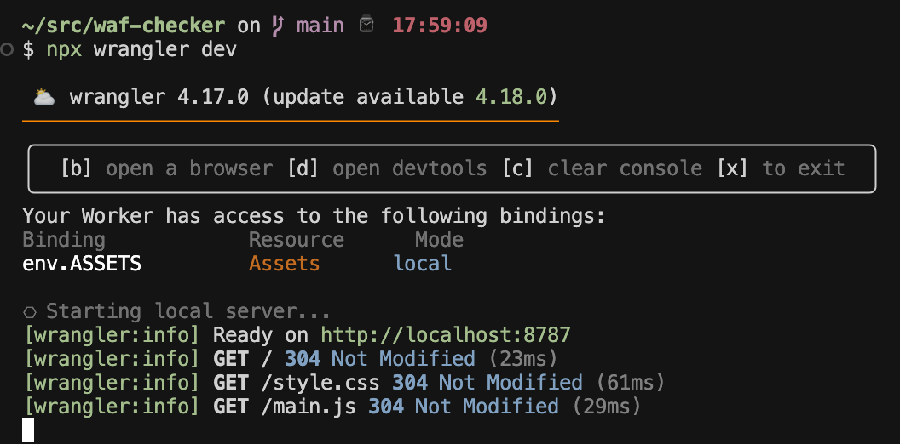

# WAF Checker (Cloudflare Worker Style)

This project helps you check how well your Web Application Firewall (WAF) protects your product against common web attacks. It is a web application implemented in a Cloudflare Worker style using TypeScript and provides a convenient web interface for WAF testing with a wide range of attack payloads.

## Main Features
- Web interface for entering the target URL and selecting HTTP methods (GET, POST, PUT, DELETE).
- Flexible selection of attack categories (SQLi, XSS, Path Traversal, Command Injection, SSRF, NoSQLi, LFI, SSTI, XXE, HTTP Header, and more).
- Each category uses its own set of payloads (in parameters, headers, or as file paths).
- Automatic sending of requests with payloads for the selected categories and methods.
- Color-coded results by status code:
  - 2xx/5xx — red (potential vulnerability)
  - 403 — green (WAF blocks)
  - other 4xx — orange (non-standard response)
- Results are displayed in a table with details for each payload.
- Easily extendable payload list (see `app/src/payloads.ts`).

## How to Use
1. Install wrangler https://developers.cloudflare.com/workers/wrangler/install-and-update/ (dependencies: node & npx)
2. Run `npx wrangler dev`
   

## Project Structure
- `app/src/api.ts` — server logic: request handling, payload sending, `/api/check` API
- `app/src/payloads.ts` — all attack categories and payloads
- `app/src/static/index.html` — main web interface (Bootstrap, JS)
- `app/src/static/main.js` — frontend logic and UI handlers
- `app/src/static/style.css` — custom styling and theme support

## Extending Payloads
To add or modify payloads, edit the `app/src/payloads.ts` file. You can add new categories, payloads, and check types (in parameters, headers, as file).

---

The project requires Node.js and can be deployed as a Cloudflare Worker or on any server supporting the Fetch API.
